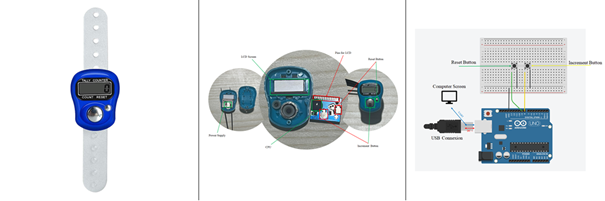

# Zikr

This simple Arduino project implements a digital *zikr* counter.  
It currently provides the following features:

* Increment the counter
* Reset the counter
* Save the counter state in EEPROM memory (persistent across Arduino board resets)

See [project.pdf](project.pdf) for more details.

## Current Status

- **zikr.ino**: The counter value is displayed via the Serial Monitor at **9600 baud**.  
- **zikr_lcd.ino**: The counter value is displayed via an LCD screen.  

## References

* [Tinkercad Circuits](https://www.tinkercad.com/dashboard/designs/circuits)  
* [Arduino EEPROM Guide](https://docs.arduino.cc/learn/programming/eeprom-guide/)  
* [Liquid Crystal Displays (LCD) with Arduino](https://docs.arduino.cc/learn/electronics/lcd-displays/)