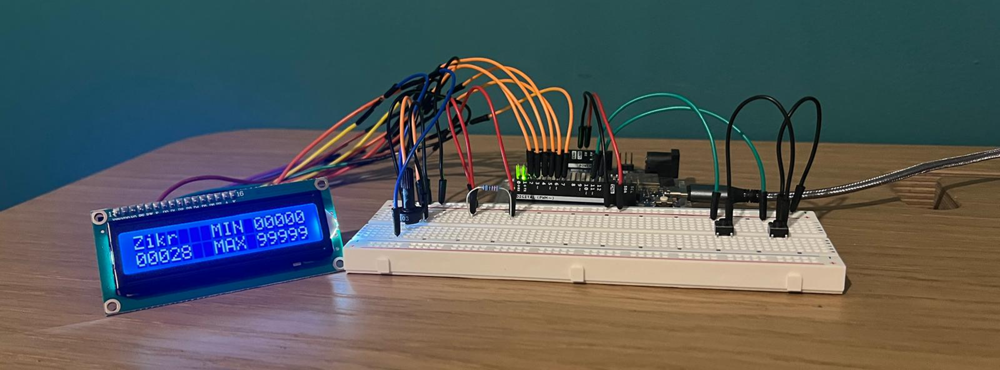

# Zikr

This Arduino project implements a simple digital *zikr* counter.
It currently provides the following features:

* Increment the counter
* Reset the counter
* Save the counter state in EEPROM memory (persistent across Arduino resets)

See [project.pdf](project.pdf) for more details.

## Current Status

* **zikr.ino**: Displays the counter value via the Serial Monitor at **9600 baud**.

* **zikr_lcd.ino**: Displays the counter value on an LCD screen.

* **zikr_lcd_infrared.ino**: Replaces physical buttons with remote control via an infrared receiver.
  * Uses an I2C-connected LCD for fewer wires.
  * Add decrement function.

## References

* [Tinkercad Circuits](https://www.tinkercad.com/dashboard/designs/circuits)
* [Arduino EEPROM Guide](https://docs.arduino.cc/learn/programming/eeprom-guide/)
* [Liquid Crystal Displays (LCD) with Arduino](https://docs.arduino.cc/learn/electronics/lcd-displays/)
* [I2C Liquid Crystal Displays (LCD) with Arduino](https://projecthub.arduino.cc/arduino_uno_guy/i2c-liquid-crystal-displays-5eb615)